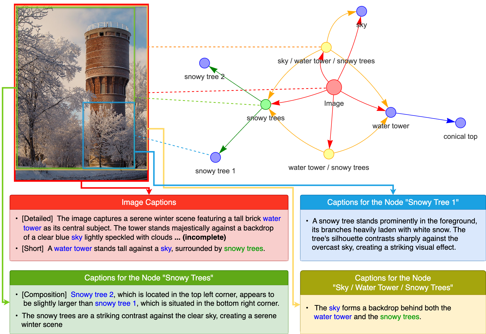
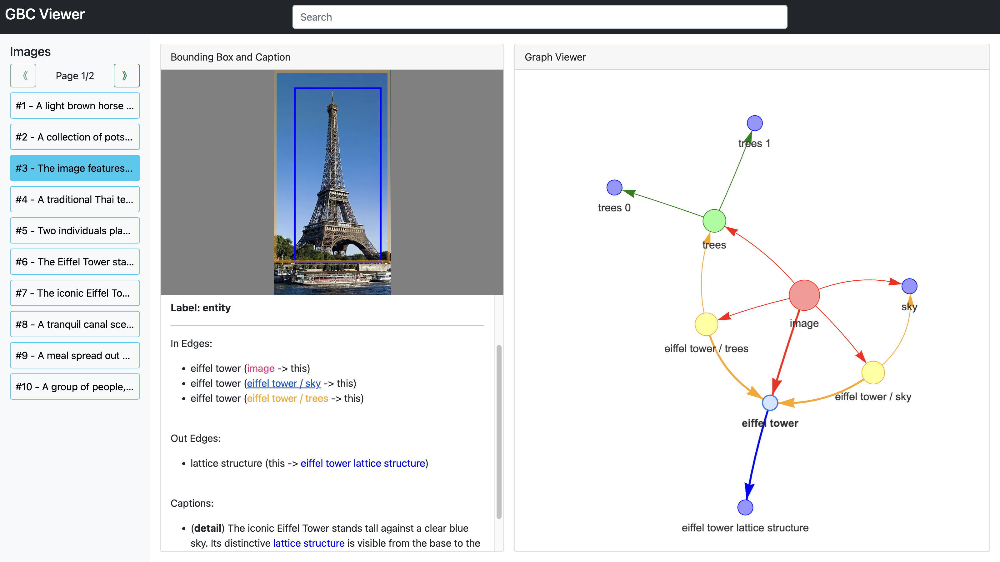
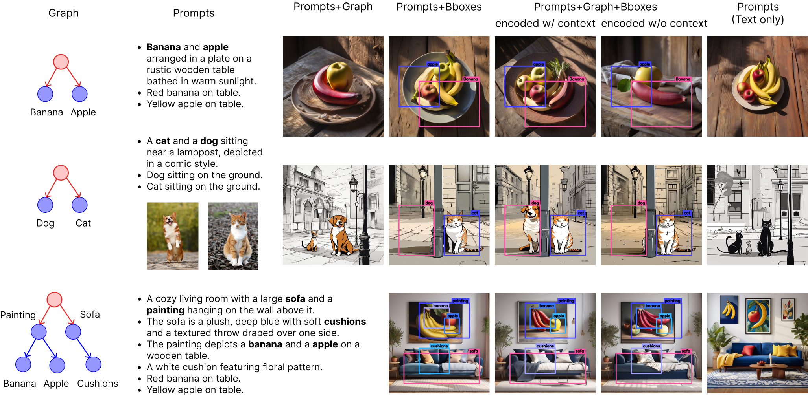

# Graph Based Captioning (GBC)

[](https://arxiv.org/abs/2407.06723)
[](https://huggingface.co/graph-based-captions)

Official repository for the paper **[Graph-Based Captioning: Enhancing Visual Descriptions by Interconnecting Region Captions](https://arxiv.org/abs/2407.06723)**.

<p align="center">

</p>


## Overview

Graph-based captioning interconnects region captions to form an integral, structured, and fine-grained description of an image.
This codebase contains code for the following purposes.

- [GBC Data Loading and Processing](#%EF%B8%8F-gbc-data-loading-and-processing)
- [GBC Visualization](#%EF%B8%8F-gbc-visualization)
- [GBC Text-to-Image](#-gbc-text-to-image)
- [GBC Captioning](#%EF%B8%8F-gbc-captioning)


## 🚀 Get Started

To begin using the library, follow these steps to set up your environment.
Depending on your intended use, you may need to install optional dependencies or perform additional setup.

### Step 1: Set Up a Conda Environment

First, create and activate a new Conda environment with Python >= 3.10:

```bash
conda create -n gbc python=3.10 -y
conda activate gbc
```

### Step 2: Install the Library (with Optional Dependencies)

Install the library. If needed, include optional dependencies tailored to specific features:

```bash
python -m pip install ".[optional_dependencies]"
```

### Step 3: Additional Setup

- Please refer to [GBC Captioning](#%EF%B8%8F-gbc-captioning) for additional steps that are needed for running the captioning pipeline with specific models.
- The [GBC viewer](#%EF%B8%8F-gbc-visualization) is standalone and does not require the base `gbc` library but has separate installation steps.


## ⚙️ GBC Data Loading and Processing

We define two Python classes for our GBC annotations: [`GbcGraph`](src/gbc/data/graph/gbc_graph.py#L30) and [`GbcGraphFull`](src/gbc/data/graph/gbc_graph_full.py#L120).

While the released dataset adheres to the `GbcGraph` class structure, all functionalities are implemented in `GbcGraphFull`. Therefore, `GbcGraphFull` is the recommended class for usage. You can load the released data into `GbcGraphFull` as follows.

```python
from datasets import load_dataset
from gbc.data import GbcGraph, GbcGraphFull

ds = load_dataset("graph-based-captions/GBC1M", split="train") # or GBC10M
gbc_graphs = []
for record in ds.select(range(100)):
    gbc_graph = GbcGraphFull.model_validate(record)
    # # Equivalently
    # gbc_graph = GbcGraph.model_validate(gbc_graph)
    # gbc_graph = GbcGraphFull.from_gbc_graph(gbc_graph)
    gbc_graphs.append(gbc_graph)
```

To load data from local files:

```python
from gbc.utils import load_list_from_file
from gbc.data import GbcGraphFull

gbc_graphs = load_list_from_file("data/gbc/wiki/wiki_gbc_graphs.jsonl", class_type=GbcGraphFull)
```

### Data Processing

You can leverage the [data processing script](./scripts/processing/process_gbc.py) to process GBC graphs locally.
To do this, specify a transform function in the configuration file. The transform function should take a `GbcGraph` or `GbcGraphFull` as input and return either a dictionary or a [pydantic](https://docs.pydantic.dev/latest/) object.
We provide several pre-defined transform functions in [src/gbc/processing/data_transforms](src/gbc/processing/data_transforms).

For transform functions that compute CLIP or toxicity scores, ensure you have the `processing` optional dependency installed: 

```bash
python -m pip install ".[processing]"
```

### Data Processing Examples

<details>

<summary>Click to expand</summary>
    
#### File Format Conversion

When no configuration file is provided, the script can be used to convert files between `.parquet`, `.jsonl`, and `.json` formats. For example, the following command converts a `.jsonl` file to `.parquet`:

```bash
python scripts/processing/process_gbc.py \
    --input_paths data/gbc/wiki/wiki_gbc_graphs.jsonl \
    --input_formats .jsonl \
    --save_format .parquet \
    --save_dir tests/outputs/processing/conversion/
```

The `--input_paths` argument accepts one or more file or folder paths. If a folder is specified, all files within the folder and its subfolders matching the specified `--input_formats` will be processed.

#### Graph to Text

The following converts graphs to dictionaries, where the `text` field contains specifically formatted text that accounts for the graph structure, and the `image_path` and `image_url` fields store the corresponding image path and URL.
    
```bash
python scripts/processing/process_gbc.py \
    --configs configs/processing/to_structured_text.yaml
```

**Note:** We directly specify all the arguments such as `--input_paths`, `--input_formats`, `--save_format`, and `--save_dir` in the configuration file, so there is no need to provide them as command-line arguments.

#### CLIP/Toxicity Score Computation

To compute CLIP scores:

```bash
python scripts/processing/process_gbc.py \
    --configs configs/processing/compute_clip_scores.yaml
```

To compute toxicity scores:

```bash
python scripts/processing/process_gbc.py \
    --configs configs/processing/compute_toxicity_scores.yaml
```

To compute both CLIP and toxicity scores:

```bash
python scripts/processing/process_gbc.py \
    --configs configs/processing/compute_all_scores.yaml
```

#### Filtering

Basic filtering with vertex/caption type, bounding box size etc.:

```bash
python scripts/processing/process_gbc.py \
    --configs configs/processing/relation_composition_filtering.yaml
```

More advanced filtering based on CLIP score:

```bash
python scripts/processing/process_gbc.py \
    --configs configs/processing/clip_filtering.yaml
```
    
</details>

## 🎞️ GBC Visualization

We provide a standalone viewer for exploring GBC-annotated data interactively. You can use it with our released datasets or your own data processed through our pipeline. Please see the [viewer](./viewer/) folder for more details.

<p align="center">

</p>

## 🎨 GBC Text-to-Image

We introduce methods to generate GBC from simple text prompt and to generate image from GBC. To enable these features, please install with the `t2i` optional dependency.

```bash
python -m pip install ".[t2i]"
```

### Text-to-GBC

This process relies on our [released 200M language model](https://huggingface.co/graph-based-captions/GBC10M-PromptGen-200M). You can run the [prompt generation script](scripts/generation/t2gbc.py) using the following command, with the generated graphs saved as [`GbcGraph`](src/gbc/data/graph/gbc_graph.py#L30) in `.json` file (you can also save them in `.parquet` or `.jsonl` files).

```bash
python scripts/generation/t2gbc.py \
    --configs configs/generation/t2gbc_default.yaml \
    --prompt_file prompts/t2i/t2gbc_seed_with_entity_specification.yaml \
    --save_file tests/outputs/generation/t2gbc/gbc_prompt_gen.json \
    --prompt_gen_model_name_or_path graph-based-captions/GBC10M-PromptGen-200M
```

#### Prompt Specification

The prompts can be provided in two formats: `.txt` or `.yaml`

- The `.txt` files should contain a single prompt in each line (e.g., [prompts/t2i/t2gbc_seed.txt](prompts/t2i/t2gbc_seed.txt)).
- The `.yaml` files should have prompts formatted as a list (e.g., [prompts/t2i/t2gbc_seed.yaml](prompts/t2i/t2gbc_seed.yaml)).

Moreover, you can use brackets to indicate the objects from the seed prompts that need further description. For example, in [prompts/t2i/t2gbc_seed_with_entity_specification.yaml](prompts/t2i/t2gbc_seed_with_entity_specification.yaml), we have

```yaml
- A cozy library room with a large wooden [bookshelf], a [leather armchair], and a small reading table with an old [lamp].
- A [turtle] sunbathing on a [log] in a quiet pond, with lily pads floating on the water.
- A [frog] in a mystical forest filled with oversized mushrooms.
- A steampunk-inspired workshop with gears on the walls and a [mechanical cat].
```

This requires the model to create three children from the root node with labels `bookshelf`, `leather armchair`, and `lamp` for the first prompt, two children from the root node with labels `turtle` and `log` for the second prompt, and so on.


### GBC-to-Image

Our training-free approach allows to sample images from GBC prompts using [SDXL](https://huggingface.co/stabilityai/stable-diffusion-xl-base-1.0). For this you need to choose an appropriate configuration file and run

```bash
python scripts/generation/gbc2i.py \
    --configs path/to/config.yaml \
    --prompt_files prompt_file_1 prompt_file_2 \
    --neg_prompt_files neg_prompt_file_1 neg_prompt_file_2 \
    --save_dir output_folder
```

#### Prompt Specification

The prompts can be provided in two formats: `.yaml` files (typically user-specified) and GBC annotations (`.parquet`, `.jsonl`, `.json`) produced by our tools.
- User-specified `.yaml` prompts are either strings (e.g., [prompts/t2i/t2gbc_seed.yaml](prompts/t2i/t2gbc_seed.yaml)) or instances of the [`GbcPrompt`](src/gbc/t2i/prompt.py#L34) class (e.g., [prompts/t2i/living_room.yaml](prompts/t2i/living_room.yaml)).
- GBC annotations (`.parquet`, `.jsonl`, `.json`) are files containing GBC data stored under the [`GbcGraph`](src/gbc/data/graph/gbc_graph.py#L30) class, produced either by the captioning pipeline or our text-to-GBC model (e.g. [data/gbc/prompt_gen/library_turtle_frog_steamponk.json](data/gbc/prompt_gen/library_turtle_frog_steamponk.json)).
 
#### Examples

We explain below which configuration to use for each of the algorithm shown in the figure. We use the default negative prompt file [prompts/t2i/neg_default.yaml](prompts/t2i/neg_default.yaml).

<p align="center">

</p>

<details>

<summary>Click to expand</summary>

##### Vanilla SDXL Sampling (Column 5)

```bash
python scripts/generation/gbc2i.py \
    --configs configs/generation/gbc2i/sampling_base.yaml \
    --prompt_files prompts/t2i/t2gbc_seed.yaml
```

**Note:** We simply sample from plain text here. There is not a specific implementation for sampling from concatenation of GBC prompts.

##### Sampling from Prompts and Bounding Boxes (Column 2)

```bash
python scripts/generation/gbc2i.py \
    --configs configs/generation/gbc2i/sampling_region_base.yaml \
    --prompt_files prompts/t2i/banana_apple.yaml prompts/t2i/living_room.yaml
```

With [IP Adapter](https://github.com/tencent-ailab/IP-Adapter)

```bash
python scripts/generation/gbc2i.py \
    --configs configs/generation/gbc2i/sampling_region_base_ipa.yaml \
    --prompt_files prompts/t2i/dog_cat_ref_image.yaml
```
 
##### Sampling from Prompts, Bounding Boxes, and Graph; Prompts Encoded with Context (Column 3)

```bash
python scripts/generation/gbc2i.py \
    --configs configs/generation/gbc2i/sampling_region_gbc_encode_with_context.yaml \
    --prompt_files prompts/t2i/banana_apple.yaml prompts/t2i/living_room.yaml
```

With [IP Adapter](https://github.com/tencent-ailab/IP-Adapter)

```bash
python scripts/generation/gbc2i.py \
    --configs configs/generation/gbc2i/sampling_region_gbc_encode_with_context_ipa.yaml \
    --prompt_files prompts/t2i/dog_cat_ref_image.yaml
```

##### Sampling from Prompts, Bounding Boxes, and Graph; Prompts Encoded without Context (Column 4)

```bash
python scripts/generation/gbc2i.py \
    --configs configs/generation/gbc2i/sampling_region_gbc_encode_without_context.yaml \
    --prompt_files prompts/t2i/banana_apple.yaml prompts/t2i/living_room.yaml
```

With [IP Adapter](https://github.com/tencent-ailab/IP-Adapter)

```bash
python scripts/generation/gbc2i.py \
    --configs configs/generation/gbc2i/sampling_region_gbc_encode_without_context_ipa.yaml \
    --prompt_files prompts/t2i/dog_cat_ref_image.yaml
```

##### Sampling from Prompts and Graph (Column 1)

Prompts encoded with context
    
```bash
python scripts/generation/gbc2i.py \
    --configs configs/generation/gbc2i/sampling_gbc_encode_with_context.yaml \
    --prompt_files prompts/t2i/banana_apple_graph_only.yaml prompts/t2i/living_room_graph_only.yaml
```
    
Prompts encoded without context
    
```bash
python scripts/generation/gbc2i.py \
    --configs configs/generation/gbc2i/sampling_gbc_encode_without_context.yaml \
    --prompt_files prompts/t2i/banana_apple_graph_only.yaml prompts/t2i/living_room_graph_only.yaml
```
    
Prompts encoded with context + [IP Adapter](https://github.com/tencent-ailab/IP-Adapter)
    
```bash
python scripts/generation/gbc2i.py \
    --configs configs/generation/gbc2i/sampling_gbc_encode_with_context_ipa.yaml \
    --prompt_files prompts/t2i/dog_cat_ref_image_graph_only.yaml prompts/t2i/living_room_graph_only.yaml
```

**Note:** This algorithm is only expected to work when the underlying graph is star graph. Moreover, we use prompt files which assign empty bounding boxes to all but the first prompt. This ensures that only the first prompt is used in the first phase (in fact, the first phase runs the sampling algorithm that uses both prompts and bounding boxes).

</details>  
    
### Text-to-Image with GBC as middleware

You can use generated prompts to generate images as follows. In this case, you can also specify `graph_transform` in configuration file (use for example those defined in [src/gbc/processing/data_transforms](src/gbc/processing/data_transforms)).

```bash
python scripts/generation/gbc2i.py \                                                                                        
    --configs configs/generation/gbc2i/sampling_region_gbc_encode_with_context.yaml \
              configs/generation/graph_transform_ex.yaml \
    --prompt_files data/gbc/prompt_gen/library_turtle_frog_steamponk.json
```

Alternatively, the following allows to run the two phases together.

```bash
python scripts/generation/t2gbc2i.py \
    --configs configs/generation/t2gbc_default.yaml \
              configs/generation/gbc2i/sampling_region_gbc_encode_with_context.yaml \
              configs/generation/graph_transform_ex.yaml \
    --prompt_file prompts/t2i/t2gbc_seed_with_entity_specification.yaml \
    --neg_prompt_file prompts/t2i/neg_default.yaml \
    --save_dir tests/outputs/generation/t2gbc2i/sdxl-region-gbc-with-context
```

Once the GBC and images are generated, you can visualize them with our viewer as follows (assume that you have installed and built the viewer):

```bash
python viewer/server/api.py \
    --path tests/outputs/generation/t2gbc2i/sdxl-region-gbc-with-context \
    --frontend_path viewer/dist
```


## 🖋️ GBC Captioning

To generate GBC annotations for your own images, install the `captioning` optional dependency.

```bash
python -m pip install ".[captioning]"
```

Moreover, depending on the models used in the captioning process, you may need additional steps to download pre-trained models or install extra dependencies. 
By default, the code uses [Pixtral](https://huggingface.co/mistralai/Pixtral-12B-2409) for MLLM queries and [GroundingDINO](https://github.com/IDEA-Research/GroundingDINO/) as detection model.

<details>
<summary>Click to expand</summary>

#### Use Pixtral

We use [vllm](https://docs.vllm.ai/en/latest/) to load [neuralmagic/pixtral-12b-FP8-dynamic](https://huggingface.co/neuralmagic/pixtral-12b-FP8-dynamic).
There is no extra installation step provided that we already include [vllm](https://docs.vllm.ai/en/latest/)  in the dependencies.
However, you may need to adjust `gpu_memory_utilization` in the config file to match your system's memory capacity.

#### Use Grounding DINO

We leverage the [GroundingDINO implementation from Huggingface](https://huggingface.co/docs/transformers/model_doc/grounding-dino).
Therefore, no additional preparation steps are needed for this model. 
However, it does require the `transformers` version to be >= 4.40.

#### Use LLaVA 1.6

To use LLaVA-1.6 for captioning, run the following script to set up the necessary dependencies and download the required models:

```bash
bash scripts/setup/setup_llava_query.sh
```

**Note:** This assumes that GPU is available and installs [llama-cpp-python](https://github.com/abetlen/llama-cpp-python) with CUDA support.
You may need to modify the installation command depending on your specific environment.

#### Use YOLO-World

Our implementation is based on the [original YOLO-World repository](https://github.com/AILab-CVC/YOLO-World).
The following script clones the repository, installs the necessary dependencies, and downloads the required models.

```
bash scripts/setup/setup_yolo_world_detection.sh
```

</details>

### Running from the CLI

You can then use [the captioning script](./scripts/captioning/run_gbc_captioning.py) as follows:

```bash
python scripts/captioning/run_gbc_captioning.py \
    --img_paths img_folder_1 img_folder_2 img_1.png img_2.jpg \
    --save_dir output_folder \
    --config_file configs/captioning/default.yaml \
    --save_frequency 50 \
    --save_images \
    --attempt_resume \
    --save_format .jsonl .parquet
```

The above command performs GBC captioning for `img_1.png`, `img_2.jpg`, and all the images found recursively under `img_folder_1` and `img_folder_2`.
The results are then saved to `output_folder` in both `.jsonl` and `.parquet` formats, each containing all annotations.

**Arguments**
- `--img_paths`: Specify the image files and folders to be captioned.
- `--save_dir`: Directory where the output will be saved.
- `--config_file`: Path to the configuration file.
- `--save_frequency`: The frequency in terms of number of completed actions for saving intermediate artifacts. This helps in resuming the process if interrupted.
- `--save_images`: Save all the input images used in each query. 
- `--attempt_resume`: Attempt to resume the captioning process if it was interrupted.
- `--save_format`: Specify the output formats (`.json`, `.jsonl`, or `.parquet`).

**Note**
- The `--save_images` flag is primarily for debugging and understanding the process. It is not recommended for captioning a large number of images as it will save all input images used in each query.
- There are additional arguments available that are not listed here. Please refer to the script itself or use the `--help` option for a complete list of arguments.

**Configuration File**

The captioning process can utilize an optional configuration file to define the captioning details. By leveraging [Hydra](https://hydra.cc/docs/intro/), you can specify the exact implementation for each query type---Image, Entity, Relation, Composition, and Detection(s) alike---under the `queries` section. Refer to [configs/captioning/default.yaml](./configs/captioning/default.yaml) for an example.
You can also provide custom implementations for each query type, as long as they subclass [`Action`](src/gbc/captioning/primitives/action.py#L21) and adhere to the required method signature.

*The `pipeline_config` section is ignored when running the captioning script.


### Running with Python


The captioning actions and pipelines are all defined in [`gbc.captioning`](src/gbc/captioning). It suffices to instantiate a [`GbcPipeline`](src/gbc/captioning/pipeline/pipeline.py#L76) object.

```python
from omegaconf import OmegaConf
from objprint import op

from gbc.utils import save_list_to_file
from gbc.captioning import GbcPipeline

config = OmegaConf.load("configs/captioning/default.yaml")
gbc_pipeline = GbcPipeline.from_config(config)

img_file_1 = "data/images/wiki/Eiffel_tower_0.jpg"
img_file_2 = "data/images/wiki/Eiffel_tower_1.jpg"

# Perform captioning on a single image
gbc = gbc_pipeline.run_gbc_captioning(img_file_1)
# Pretty print the GBC graph
op(gbc[0].model_dump())

# Perform captioning on multiple images
gbcs = gbc_pipeline.run_gbc_captioning([img_file_1, img_file_2])
# Save the GBC graphs, can save as json, jsonl, or parquet
save_list_to_file(gbcs, "tests/outputs/captioning/gbc_eiffel_tower.json")
```

In this case, further configuration detail about the pipeline are to be listed in the `pipeline_config` section in the configuration file unless you provide them separately as input of [`GbcPipeline.from_config`](src/gbc/captioning/pipeline/pipeline.py#L159).

Alternatively, you can use the [functional interface](src/gbc/captioning/pipeline/pipeline_functional.py).

```python
from omegaconf import OmegaConf
from objprint import op

from gbc.utils import save_list_to_file
from gbc.captioning import run_gbc_captioning

config = OmegaConf.load("configs/captioning/default.yaml")

img_file_1 = "data/images/wiki/Eiffel_tower_0.jpg"
img_file_2 = "data/images/wiki/Eiffel_tower_1.jpg"

# Perform captioning on a single image
gbc = run_gbc_captioning(img_file_1, config, include_relation_query=False)
# Pretty print the GBC graph
op(gbc[0].model_dump())

# Perform captioning on multiple images
gbcs = run_gbc_captioning(
    [img_file_1, img_file_2], config, batch_query=True, batch_size=8
)
# Save the GBC graphs, can save as json, jsonl, or parquet
save_list_to_file(gbcs, "tests/outputs/captioning/gbc_batch_eiffel_tower.json")

```


## License

This project is distributed under the following terms:

- The code is distributed under [Apple Sample Code license](LICENSE).
- The [datasets](https://huggingface.co/graph-based-captions) are distributed under [CC BY-NC 4.0](https://creativecommons.org/licenses/by-nc/4.0/deed.fr) License.


## Acknowledgement

Our codebase builds upon several open-source projects. We highlight some of the most important ones below:

- Our captioning code uses either [Pixtral](https://huggingface.co/mistralai/Pixtral-12B-2409), [LLaVA](https://github.com/haotian-liu/LLaVA), [GroundingDINO](https://github.com/IDEA-Research/GroundingDINO), or [YOLO-World](https://github.com/AILab-CVC/YOLO-World).
- Our text-to-image sampling code is mainly based on [Diffusers](https://huggingface.co/docs/diffusers/index), [k-diffusion](https://github.com/crowsonkb/k-diffusion), [UwUDiff](https://github.com/KohakuBlueleaf/UwUDiff), and [SDXL](https://huggingface.co/stabilityai/stable-diffusion-xl-base-1.0).


## Citation

```bibtex
@article{GBC2024,
  title={Graph-Based Captioning: Enhancing Visual Descriptions by Interconnecting Region Captions},
  author={Yu-Guan Hsieh and Cheng-Yu Hsieh and Shih-Ying Yeh and Louis Béthune and Hadi Pouransari and Pavan Kumar Anasosalu Vasu and Chun-Liang Li and Ranjay Krishna and Oncel Tuzel and Marco Cuturi},
  journal={arXiv preprint arXiv:2407.06723},
  year={2024}
}
```
